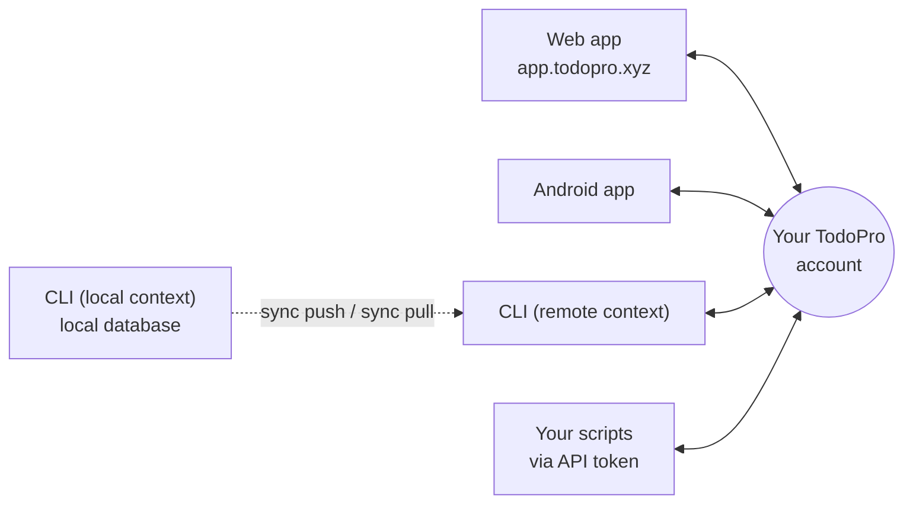

# Apps

TodoPro is one account on four surfaces. Whatever you add in one place shows up in the others.

- **[Web app](web.md)** — the full-featured primary interface at [app.todopro.xyz](https://app.todopro.xyz).
- **[Mobile app](mobile.md)** — Android, offline-first, with push notifications.
- **[CLI](cli.md)** — `todopro` (alias `tp`) in your terminal.
- **API** — programmatic access using a personal access token from your settings.

## Which surface for what

| Surface | Best for | Works offline |
|---|---|---|
| Web app | Planning, reporting, project setup, collaboration, integrations | Yes |
| Mobile app | Capture on the go, reminders, checking off tasks | Yes |
| CLI | Fast keyboard capture, scripting, focus sessions, local-only use | Yes (local context) |
| API | Automation and your own tools | n/a |

Most people use the web app as their home base, the mobile app for capture and reminders, and the CLI when they are already in a terminal.

## Sync and offline

Everything is backed by the same account. The web and mobile apps keep a local copy of your data, so they keep working when you lose connection: your changes are stored and replayed automatically once you are back online. When you are connected, updates appear in **real time** — complete a task on your phone and it disappears from the web app without a refresh.

The CLI is the exception worth knowing about: it can run entirely against a local database on your machine instead of your account. See [contexts](cli.md#contexts-local-vs-remote) for how that works and how to sync between the two.

!!! note
    There is no iOS app at the moment. On an iPhone or iPad, use the web app at [app.todopro.xyz](https://app.todopro.xyz).

## Related pages

- [Create your account](../getting-started/create-account.md)
- [Quick add syntax](../getting-started/quick-add-syntax.md) — identical on web, mobile, and CLI
- [Security](../account/security.md) — passkeys, sign-in activity, personal access tokens
