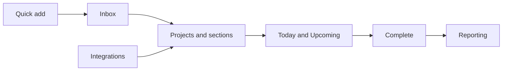

# TodoPro Help

Welcome to the TodoPro help center. Here you will find guides for everything from adding your first task to syncing GitHub Projects into your day.

## What TodoPro is

TodoPro is a task manager built around one idea: capture work the moment you think of it, then let the app do the organizing.

You type a single line like `Email Sam about the deck tomorrow 9am #Work @email p1`, and TodoPro turns it into a task with a due date, a project, a label, and a priority.

TodoPro works across four surfaces that all share one account:

- A **web app** you can use in any browser, even offline.
- A **mobile app** for Android, with push reminders.
- A **command line app** for your terminal.
- An **API** for your own scripts and automations.

Changes you make on one device show up on the others in real time.

## Start here

If you are brand new, follow these three pages in order.

1. [Create your account](getting-started/create-account.md) — sign up and get into the app.
2. [Add your first task](getting-started/first-task.md) — capture something and complete it.
3. [Quick-add syntax](getting-started/quick-add-syntax.md) — the one page that makes TodoPro fast.

!!! tip "Learn the quick-add syntax early"
    Almost everything in TodoPro can be typed into a single line: dates, projects, labels, priorities, reminders, and repeats.
    Fifteen minutes with the [quick-add reference](getting-started/quick-add-syntax.md) will save you hours.

## Pick your surface

=== "Web"

    The full experience at [app.todopro.xyz](https://app.todopro.xyz).
    Every feature lives here: projects, board views, reporting, sharing, and settings.

    [Read the web guide](apps/web.md)

=== "Mobile"

    The Android app for capturing work away from your desk.
    It keeps working without a connection and replays your changes when you reconnect.

    [Read the mobile guide](apps/mobile.md)

=== "CLI"

    The `todopro` command (short alias: `tp`) for people who live in a terminal.
    It can run entirely on your own machine or against your TodoPro account.

    [Read the CLI guide](apps/cli.md)

## Browse the docs

| Section | What is inside |
| --- | --- |
| [Getting started](getting-started/index.md) | Account setup, your first task, quick-add syntax |
| [Tasks](tasks/index.md) | Dates, deadlines, priorities, repeats, reminders, subtasks, labels, filters |
| [Projects](projects/index.md) | Projects, sections, views and layouts, sharing, templates |
| [Productivity](productivity/index.md) | Today and Upcoming, focus sessions, reporting |
| [Apps](apps/index.md) | Web, mobile, and command line |
| [Integrations](integrations/index.md) | GitHub Projects, calendars, and the Hub |
| [TodoPro Pro](pro/index.md) | What Pro unlocks and how to start a trial |
| [Account](account/index.md) | Profile, security, import and export |
| [FAQ](faq.md) | Short answers to common questions |
| [Troubleshooting](troubleshooting.md) | Fixes for the problems people hit most |

## How the pieces fit together

Capture into the Inbox without thinking about structure, sort items into projects when you have a moment, work from Today and Upcoming, and review what you finished in Reporting.

## Free and Pro

TodoPro is free to use, with a Pro plan that adds deadlines, shared projects, integrations, and more.

Every new account can start a **7-day Pro trial** from inside the app. See [TodoPro Pro](pro/index.md) for the full comparison, and [todopro.xyz/pricing](https://todopro.xyz/pricing) for current pricing.
