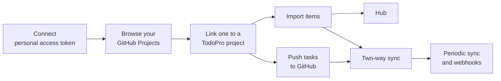

# GitHub Projects

The GitHub Projects integration brings your GitHub Projects boards into TodoPro.
You connect a GitHub personal access token, link a GitHub Project to a TodoPro project, import its items, push your TodoPro tasks back to GitHub, and keep both sides in sync.

!!! info "Pro feature"
    This requires a TodoPro Pro subscription. See [TodoPro Pro](../pro/index.md).

## How it fits together



## Step 1: Create a personal access token

TodoPro connects to GitHub using a personal access token that you create in your GitHub account settings.

Grant the token these permissions:

| You want to… | Access the token needs |
|---|---|
| View, import, and sync Projects | Read access to projects (read and write if you also push to GitHub) |
| Sync issues and pull requests in those projects | Read access to issues and repository contents (read and write if pushing changes back) |
| Use projects owned by an organization | Set the token's resource owner to the organization, have the organization approve the token, and grant read access to organization members |

!!! tip
    Prefer a fine-grained token with the smallest set of permissions that covers what you need, and give it an expiry date.
    You can disconnect at any time, and you can revoke the token from GitHub.

!!! warning "Organization projects not showing up?"
    A fine-grained token needs **member read access** for the organization in addition to projects access.
    Without it, your organization boards come back empty even though the token can read them.
    Add member read access to the existing token and reconnect — you do not need to create a new token.

Classic tokens also work.
For organization projects with a classic token, include the organization read scope alongside project and repository access.

## Step 2: Connect

1. Go to **Settings → Integrations**.
2. In the **GitHub** section, paste your token into the token field and save.

TodoPro checks the token with GitHub before saving it.
An invalid token is rejected.

Once connected, the status card shows your GitHub login, the kind of token, the permissions it was granted, a masked tail of the token, and its expiry date.
The full token is never shown again, and it is stored encrypted.

To remove the connection, use **Disconnect** in the same section.

## Step 3: Browse and link a project

Open the GitHub Projects browser in **Settings → Integrations** to see every GitHub Project your token can reach — your own projects and any organization projects it has access to.

Choose one and select **Link to TodoPro project**.
Each GitHub Project links to exactly one TodoPro project.

When you link, you choose a sync direction:

- **Two-way sync** — tasks and cards stay in step in both directions.
- **GitHub → TodoPro** — pull only. Your TodoPro changes are never written back to GitHub.
- **TodoPro → GitHub** — push only. GitHub changes never overwrite your tasks.

**Board columns become sections.** The GitHub board's status column options are created as sections in the linked TodoPro project, and each synced task lands in the section matching its column.
Moving a task between sections pushes the matching status back to GitHub on two-way and push links.

!!! note
    Linking a board with columns but no cards creates the sections and imports nothing.
    Items appear once you add cards on GitHub or tasks in TodoPro.

## Step 4: Import items

Importing pulls the linked GitHub Project's items into TodoPro.
By default they arrive as items in the [Hub](index.md#the-hub) rather than as tasks in your project.
You can also choose to mirror them as regular TodoPro tasks.

Import is safe to repeat.
Re-importing skips anything that has not changed on GitHub and only updates what actually moved.

## Step 5: Push tasks to GitHub

Each linked project has a **Push to GitHub** button.
Pushing sends your TodoPro tasks for that project up to the linked GitHub Project board.

- If the linked GitHub Project has **exactly one repository**, pushing creates a real GitHub **Issue**.
- Otherwise, pushing creates a **draft item** on the board.

Push also sets the board's status, priority, and due date fields for each item, creating the priority and due date fields if the board does not have them yet.

Pushing is safe to repeat.
A task that has not changed since the last push is skipped, and a task that was pushed before is updated rather than duplicated.

## Two-way sync

Sync reconciles changes on both sides of a link.
Each linked project has a **Sync** button that reports how many items were added, updated, and skipped.

When the same item changed in both places, TodoPro resolves the conflict using the strategy you choose:

| Strategy | What happens |
|---|---|
| Newest wins (default) | Whichever side was edited most recently wins. |
| TodoPro wins | Your TodoPro version always overwrites GitHub. |
| GitHub wins | The GitHub version always overwrites your task. |

Items that have not changed are skipped, so syncing stays quick.

### Automatic sync

You do not have to sync by hand.

- **Periodic sync** runs on its own for every link that has syncing enabled.
- **Webhook sync** runs as soon as GitHub reports that an item on a linked board changed.

## Background jobs for large operations

Large syncs, pushes, and imports run in the background instead of making you wait.
The button keeps showing progress while the job runs, then reports the result when it finishes.
Any tasks that were pulled in appear in your project view automatically.

This means a big board with many items will not time out.

## Where imported items appear

Imported GitHub items land in the **Hub**, TodoPro's unified feed of external items from all your integrations.
Open **Hub** from the primary navigation.

Each Hub item shows its source, its state and status, and a link back to the original item on GitHub.
You can filter the Hub by state and by source.

If you chose to mirror items as tasks, they also appear as regular tasks in the linked TodoPro project.

## Disconnecting

Use **Disconnect** in **Settings → Integrations** to remove the GitHub connection.
Syncing stops immediately, and TodoPro no longer holds your token.
Anything already imported stays in TodoPro.

You can also revoke the token from your GitHub account settings.

## From the CLI

The CLI has a `github` command group for the whole flow — connecting a token, checking status, listing and linking projects, importing, pushing, syncing, and disconnecting.

```bash
todopro github --help
```

The unified feed has its own command:

```bash
todopro hub --help
```

These commands need a remote context (so they talk to your TodoPro account rather than a local database) and an active Pro subscription.
See [CLI](../apps/cli.md).

## Good to know

- The integration aims for reliable visibility across both tools rather than a perfect field-for-field copy.
- Status columns on GitHub are free-form, so TodoPro treats a "done"-like column as completed.
- GitHub limits how much data an app may read in a period. TodoPro works through results in pages and slows down when it hits a limit, then resumes.
- After a push, the very next sync may re-check items it just sent. This is harmless — both sides are already consistent.
- A live 7-day trial gives you full access to this integration.

## Related pages

- [Integrations overview](index.md)
- [Projects and sections](../projects/projects-and-sections.md)
- [TodoPro Pro](../pro/index.md)
