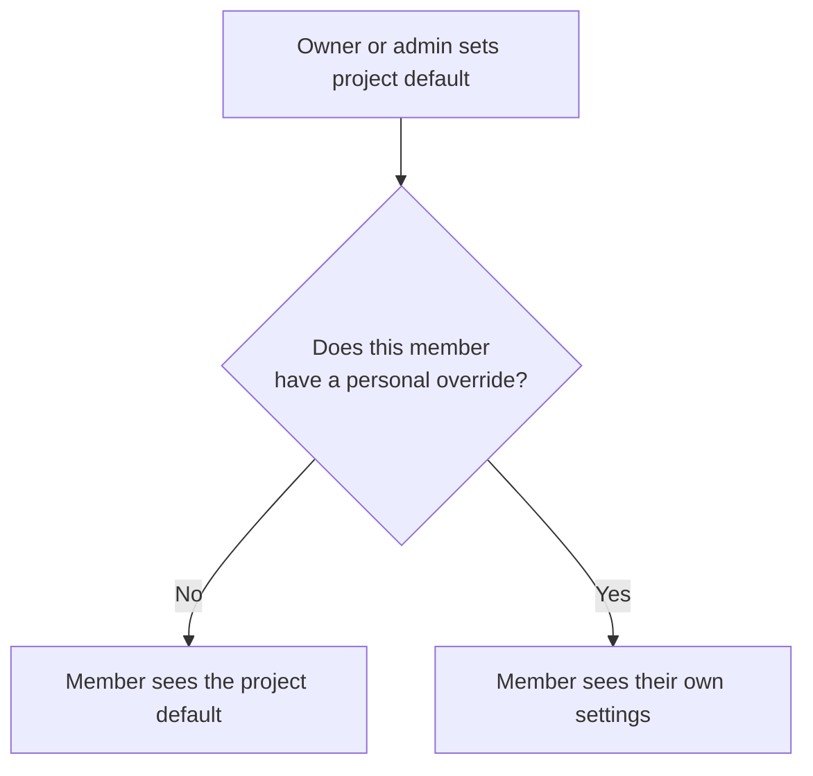

# Views and layouts

Every project can be viewed in two layouts, and each view has its own display options.
Change them freely — they only affect how tasks are shown, never the tasks themselves.

## List layout

List is the default.
Tasks appear as rows, one under another, grouped by whatever you have chosen to group by.
It is the best layout for working through a queue and for projects with many tasks.

## Board layout (Kanban)

Board turns the project into columns.
**Each column is a [section](projects-and-sections.md)**, and each task is a card.

- **Drag a card between columns** to move the task to that section.
- Drag a card into the section marked as the **Done section** to complete it.
- Add a task straight into a column with the "+ Add task" control at the bottom of the column.

=== "Web"

    Switch layout from the project's display options.
    Drag cards with your mouse to move them between columns.

=== "Mobile"

    Open the display options sheet and pick **Board** in the Layout row.
    Columns snap into place as you scroll sideways.
    Long-press a card to pick it up, then drag it to another column; dragging to the edge of the screen pages to the next column.

## Display options

Open the display options for a view to change how the tasks are arranged.

### Group by

Choose what forms the groups in the view:

- None
- Section
- Priority
- Due date
- Date added
- Deadline
- Label
- Project

### Sort by

Sort the tasks inside each group — including by **deadline** — and choose **ascending** or **descending** order.

### Show completed tasks

Turn this on to keep finished tasks visible in the view instead of having them disappear when you check them off.

### Show or hide "(No section)"

Tasks that are not in any section normally appear in a group called **(No section)**.
Hide that group if you want a clean board with only your real columns.
The built-in Kanban [template](templates.md) hides it for you.

## Project defaults and personal overrides

In a [shared project](sharing-and-collaboration.md), display settings work in two layers.

- An **owner or admin** can choose **Set as project default**. Every member who has not customized the view sees that arrangement.
- Any member can then change the display options for themselves. That personal override wins for them and does not affect anyone else.

This means a project lead can set a sensible grouping for the team while individual members still organize the view the way they prefer.

## Which settings stay on this device

Most display options — group by, sort by, show completed, show or hide "(No section)" — follow your account and appear the same everywhere you sign in.

Two settings are deliberately kept **per device**:

- The **layout** (list or board)
- The **sort direction** (ascending or descending)

!!! note
    That is why a project can look like a board on your laptop and a list on your phone.
    Set the layout once on each device you use.

## Related pages

- [Projects and sections](projects-and-sections.md)
- [Labels and filters](../tasks/labels-and-filters.md) — saved views built from criteria, with their own pages
- [Today and Upcoming](../productivity/today-and-upcoming.md)
