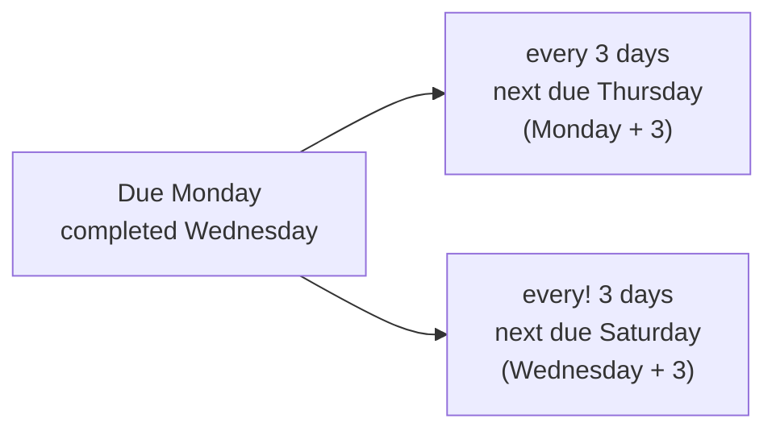

# Recurring tasks

A recurring task repeats on a schedule. Complete it, and TodoPro immediately creates the next occurrence for you. Nothing has to be re-typed, and the task keeps its project, labels, priority and description each time around.

## Making a task repeat

Write the recurrence in plain language, in quick add or in the task editor.

| You type | What happens |
|---|---|
| `every day` | Repeats daily |
| `every monday` | Repeats every Monday |
| `every 2 weeks` | Repeats fortnightly |
| `every month` | Repeats monthly |
| `every year` | Repeats yearly |

```
Water the plants every 3 days
Submit the timesheet every friday 5pm
Pay rent every month
```

=== "Web"

    Type the phrase in Quick Add, or open the task and set the repeat rule in the recurrence editor.

=== "Mobile"

    Type the phrase in quick add, or set the repeat rule from the task's bottom sheet.

=== "CLI"

    ```bash
    todopro add "Water the plants every 3 days"
    ```

## Date-anchored vs completion-anchored

This is the one thing worth understanding properly about recurrence.

By default, the next occurrence is calculated **from the due date**. The schedule is fixed: if you complete a weekly task three days late, the next one is still due on its normal day. This is what you want for anything tied to the calendar — rent, a standing meeting, a Friday report.

Adding an exclamation mark — `every!` — switches to **completion-anchored** recurrence. The next occurrence counts from the moment you actually completed the task. This is what you want for anything tied to elapsed time since you last did it: watering plants, changing the bedsheets, a haircut.

### A worked example

Take **"Water the plants every 3 days"**, first due on **Monday**. You are busy and only get to it on **Wednesday**.



With `every 3 days`, the schedule ignores when you finished — the next occurrence lands on **Thursday**, one day after you watered them. With `every! 3 days`, the clock restarts at completion and the next occurrence lands on **Saturday**, a proper three days later.

!!! tip
    Ask yourself: does this need to happen *on a schedule*, or *a certain time after the last time*? Schedule means `every`. Elapsed time means `every!`.

The exclamation mark works with any recurrence phrase: `every! week`, `every! 2 months`, `every! monday`.

## Completing a recurring task

Tick a recurring task as usual. TodoPro marks the occurrence done and rolls the task forward to its next date. You do not end up with a pile of duplicates — the task is one continuing item with a history of completions behind it.

## Skipping an occurrence

Sometimes an occurrence simply does not apply — you are away, or the week's meeting was cancelled. **Skip** moves the task to its next occurrence without marking it complete, so your completion statistics stay honest.

Skip is available from the task's actions on web and mobile.

!!! note
    Skipping is different from rescheduling. Rescheduling moves the current occurrence to a new date; skipping abandons it and jumps to the next one in the series.

## Viewing occurrences

A recurring task shows its repeat rule on the task itself, so you can tell at a glance that it will come back. Upcoming shows future occurrences in the agenda and calendar as they fall due, and the task's activity history records each completion in the series. See [Today and Upcoming](../productivity/today-and-upcoming.md).

## Changing or stopping a recurrence

Open the task and edit the repeat rule to change the schedule, or clear it to turn the task back into an ordinary one-off. Clearing the recurrence leaves the current occurrence in place with its due date intact.

Related: [Due dates and deadlines](due-dates-and-deadlines.md), [Reminders](reminders.md).
